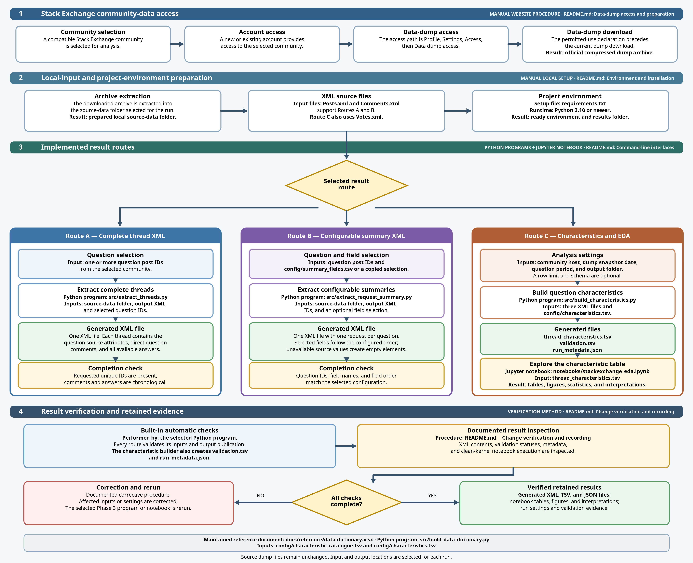

<!-- markdownlint-disable-file MD041 -->

> **From official Stack Exchange XML dumps to reconstructed question
> threads, configurable summaries, and validated evidence.**

[**Bundled analysis tutorial**](#bundled-analysis-tutorial) ·
[**Result routes**](#quick-orientation) ·
[**Workflow**](#workflow-overview) ·
[**Reference index**](#reference-index) ·
[**Verified results**](#verified-results)

## Contents

| Orientation | Tutorial | Procedures | Reference and explanation |
|---|---|---|---|
| [Quick orientation](#quick-orientation) · [Workflow](#workflow-overview) · [Project overview](#project-overview) | [Bundled analysis tutorial](#bundled-analysis-tutorial) | [How-to guides](#how-to-guides) · [Change verification](#change-verification-and-recording) | [Reference index](#reference-index) · [System reference](#system-reference) · [Scientific explanation](#scientific-and-design-explanation) · [Glossary](#glossary) · [Canonical locations](#canonical-locations) |

## Quick orientation

### Available result routes

| Path | Use case | Values selected for the run | Result to inspect |
|---|---|---|---|
| [**First complete run**](#bundled-analysis-tutorial) | Demonstration of the complete implemented analysis sequence | Fixed bundled pilot values | A validated 20-question table and an executed notebook |
| [**Complete threads**](#complete-thread-xml-creation) | Preservation of the complete available discussion for selected questions | Source folder, output file, and one or more question IDs | One XML file containing each question, its direct comments, and all available answers |
| [**Selected summary**](#selected-field-summary-xml-creation) | Compact XML reporting with selected fields | Source folder, output file, question IDs, and an optional copied field selection | One XML file containing the enabled fields in the selected order |
| [**Characteristics and EDA**](#validated-characteristic-table-construction) | Question-level measurements, checks, figures, and interpretations | Source folder, community host, dump date, question period, output folder, and optional limit | A 49-column TSV, validation report, run metadata, and notebook results |

> [!TIP]
> **Recommended starting point:** The
> [bundled analysis tutorial](#bundled-analysis-tutorial) uses a small, tracked
> input to verify the environment, characteristic build, validation, and
> notebook before larger-dump processing.

### Routine run values

- Commands run from the project root.
- Uppercase placeholders such as `DUMP_DIR` and `QUESTION_ID` receive values
  from the intended run. Brackets and an ellipsis denote optional or repeated
  values and are omitted from literal commands. The
  [command-line interface example](#command-line-interface) demonstrates this
  notation.
- Routine runs change command arguments, a copied summary-field TSV, or the
  notebook's **Editable settings** cell. Python modules and
  `config/characteristic_catalogue.tsv` and `config/characteristics.tsv`
  remain unchanged unless the documented catalogue or output contract changes.

[Back to contents](#contents)

## Workflow overview

The diagram presents the complete implemented sequence from Stack
Exchange access to inspected and retained results.



[Full-size PNG](docs/project-workflow-overview.png) ·
[Editable SVG](docs/project-workflow-overview.svg) ·
[How-to guides](#how-to-guides)

The implemented sequence is:

1. A compatible [Stack Exchange community](#stack-exchange-community) is
   selected.
2. Account creation or sign-in provides access to that community.
3. Profile settings provide data-dump access after affirmation of the displayed
   declaration.
4. The official [data dump](#data-dump) is downloaded and extracted.
5. A Python environment contains the declared dependencies.
6. One or more of the three implemented result routes are selected.
7. Run-specific paths, identifiers, dates, or field selections enter through the
   documented interfaces.
8. Each selected Python program performs its built-in checks.
9. Generated XML or TSV, validation, metadata, and notebook results receive the
   documented inspection procedure.
10. The generic notebook provides exploratory results when that route is
   required.
11. Source provenance, run settings, validation evidence, and generated results
    remain together.

Each route has a completion check in the [how-to guides](#how-to-guides). Exact
arguments and file contracts are in the [system reference](#system-reference).

[Back to contents](#contents)

## Reference index

The index maps common project needs to their exact documentation destination.

### Result procedures and inspection

| Need | Direct destination |
|---|---|
| Project summary | [Project overview](#project-overview) |
| Routine changeable values | [Quick orientation](#quick-orientation) |
| Complete sequence from Stack Exchange access to results | [Workflow overview](#workflow-overview) |
| First working example | [Bundled analysis tutorial](#bundled-analysis-tutorial) |
| Official dump registration, sign-in, and access | [Data-dump access and preparation](#data-dump-access-and-preparation) |
| Question, comment, and answer reconstruction | [Complete-thread XML creation](#complete-thread-xml-creation) |
| Summary-field selection and ordering | [Selected-field summary XML creation](#selected-field-summary-xml-creation) |
| 49-column analytical table | [Validated characteristic-table construction](#validated-characteristic-table-construction) |
| Tables, figures, and interpretations | [Exploratory notebook execution](#exploratory-notebook-execution) |
| Verified project state | [Verified results](#verified-results) |

### Interfaces and terms

| Need or term | Direct destination |
|---|---|
| A particular script, library, or notebook | [Component reference](#component-reference) |
| A command or parameter | [Command-line interfaces](#command-line-interfaces) |
| Placeholders in a command example | [Command-line interface](#command-line-interface) |
| `Posts.xml`, `Comments.xml`, or `Votes.xml` | [Source XML contracts](#source-xml-contracts) |
| An output file | [Output contracts](#output-contracts) |
| A notebook setting or figure | [Notebook interface](#notebook-interface) |
| A PASS, WARN, FAIL, or error message | [Validation and errors](#validation-and-errors) |
| An accepted answer | [Accepted answer](#accepted-answer) |
| Comments included in a thread | [Direct question comment](#direct-question-comment) |
| The 49-field current schema | [Characteristic specification](#characteristic-specification) |
| The 138-characteristic research catalogue | [Characteristic catalogue](#characteristic-catalogue) |
| Configurable summary selection | [Summary field selection](#summary-field-selection) |
| Run provenance | [Run metadata](#run-metadata) |
| Source and result folders | [Source-data folder](#source-data-folder) · [Results folder](#results-folder) |
| XML, TSV, JSON, or IPYNB files | [XML](#xml) · [TSV](#tsv) · [JSON](#json) · [Jupyter notebook](#jupyter-notebook) |
| Another technical term | [Glossary](#glossary) |

### Supporting evidence

| Need | Direct destination |
|---|---|
| Definitions and implementation status for all 138 catalogue characteristics | [Data dictionary](docs/reference/data-dictionary.xlsx) |
| Procedure for refreshing published network and tag statistics | [Published-statistics workbook refresh](#published-statistics-workbook-refresh) |
| A source, result, or supporting artifact | [Canonical locations](#canonical-locations) |
| Reuse and attribution requirements | [Reuse and attribution](#reuse-and-attribution) |
| Recorded release checks | [Release verification](docs/reference/release-verification.tsv) |

[Back to contents](#contents)

## Project overview

### Implemented result routes

| Route | Purpose | Required input | Entry point | Primary result |
|---|---|---|---|---|
| [Complete thread](#complete-thread-xml-creation) | Preservation of a question, its direct question comments, and every available answer | `Posts.xml`, `Comments.xml`, one or more question IDs | [`src/extract_threads.py`](src/extract_threads.py) | One complete-thread XML file |
| [Selected summary](#selected-field-summary-xml-creation) | Creation of a compact report with selected and ordered fields | `Posts.xml`, `Comments.xml`, question IDs, optional field-selection TSV | [`src/extract_request_summary.py`](src/extract_request_summary.py) | One configurable summary XML file |
| [Characteristics and EDA](#validated-characteristic-table-construction) | Construction and exploration of validated question-level evidence | `Posts.xml`, `Comments.xml`, `Votes.xml`, run settings, schema | [`src/build_characteristics.py`](src/build_characteristics.py), then [`notebooks/stackexchange_eda.ipynb`](notebooks/stackexchange_eda.ipynb) | TSV, validation, metadata, tables, figures, and interpretations |

The workflow accepts compatible Stack Exchange community dumps. Paths,
communities, dates, question IDs, summary fields, schemas, and output locations
are selected for each run.

[Back to contents](#contents)

## Bundled analysis tutorial

This fixed tutorial uses a small, real subset of the official Stack Exchange XML
dump. It rebuilds the tracked 20-question characteristic table and executes the
generic notebook on the generated result. The sequence demonstrates the
implemented path from XML input to interpreted figures.

> **Result:** `thread_characteristics.tsv`, `validation.tsv`,
> `run_metadata.json`, and an executed `stackexchange_eda.ipynb` produced
> from the bundled XML source rows.

### Tutorial input files

The following files must be present under the project root:

```text
data/examples/pilot_dump/Posts.xml
data/examples/pilot_dump/Comments.xml
data/examples/pilot_dump/Votes.xml
data/examples/pilot_dump/manifest.tsv
config/characteristics.tsv
notebooks/stackexchange_eda.ipynb
requirements.txt
```

The pilot dump contains real rows selected from the official April 2026 Software
Engineering public dump: 20 questions, their available answers, their direct
question comments, and the acceptance-vote rows used by the current
calculations. [`manifest.tsv`](data/examples/pilot_dump/manifest.tsv) records
its source and scope.

### Python environment

```bash
python3 -m venv .venv
source .venv/bin/activate
python -m pip install -r requirements.txt
```

A successful installation produces no error. The active POSIX terminal prompt
usually begins with `(.venv)`.

### Characteristic-table construction

The builder command runs from the project root:

```bash
python src/build_characteristics.py \
  --dump-dir data/examples/pilot_dump \
  --site softwareengineering.stackexchange.com \
  --dump-date 2026-04-20 \
  --start-date 2024-01-01 \
  --end-date 2024-12-31 \
  --limit 20 \
  --output-dir data/processed/tutorial-run \
  --overwrite
```

The expected report contains 20 selected questions and
`10 PASS, 0 WARN, 0 FAIL`. The command creates:

```text
data/processed/tutorial-run/thread_characteristics.tsv
data/processed/tutorial-run/validation.tsv
data/processed/tutorial-run/run_metadata.json
```

Every `validation.tsv` status is `PASS`. The `run_metadata.json` values
identify the community, 20 April 2026 snapshot, 2024 question period, 20-row
limit, three source files, and 20-row result. The generated characteristic TSV
contains 20 rows and 49 columns and matches
[`data/examples/characteristics_pilot.tsv`](data/examples/characteristics_pilot.tsv)
byte for byte.

### Notebook execution

```bash
python -m jupyter lab
```

1. `notebooks/stackexchange_eda.ipynb` is opened in JupyterLab.
2. The **Editable settings** cell assigns `DATA_FILE` the value
   `../data/processed/tutorial-run/thread_characteristics.tsv`.
3. **Restart Kernel and Run All Cells** is selected from the JupyterLab Kernel
   menu.
4. Tables, figures, interpretations, and availability messages are examined in
   notebook order.

The first summary reports one community, 20 questions, 49 source columns, a
question period from 1–8 January 2024, and the 20 April 2026 dump snapshot.
Every code cell completes without a Python exception.

### Expected visible evidence

- Figure 1 reports 19 questions with an available answer, 12 with an accepted
  answer, and 2 closed questions.
- Figure 2 shows cumulative question, answer, acceptance, and closure totals.
- Figure 3 uses linear numeric ranges and reports the count and maximum of
  values above each displayed range.
- Figure 4 shows the frequent tags in this 20-question table.
- Later sections display a figure when the pilot contains sufficient evidence
  and an availability message when evidence is insufficient.
- The final inspection table identifies concrete questions and gives each
  selection reason. The run-status table records every produced or unavailable
  figure group.

Every displayed figure has a plain-language interpretation. The final output
provides question IDs, titles, links, and selection reasons.

### Repeatability check

A second builder execution uses the same values and `--overwrite`, followed by
another **Restart Kernel and Run All Cells** execution. Characteristic and
validation TSV contents, tables, figures, availability messages, and pilot
totals remain unchanged. Generation time, elapsed time, and absolute source
paths in `run_metadata.json` describe each individual execution and can
therefore change.

> **Tutorial complete:** Real source XML has been transformed into a validated
> 49-field table, interpreted through the generic notebook, and reproduced.

[Back to contents](#contents)

## How-to guides

These procedures correspond to selected project goals. Exact argument
definitions remain in the [command reference](#command-line-interfaces).

### Data-dump access and preparation

> **Goal:** One readable local folder containing the XML files required by a
> selected processing route.

**Prerequisites:** A community from the
[Stack Exchange site directory](https://stackexchange.com/sites), sufficient
archive storage, and an account on that community.

1. The selected Stack Exchange community is opened with account creation or
   sign-in.
2. The profile path **Settings** → **Access** → **Data dump access** opens the
   dump-access page.
3. Access requires review of the current declaration and affirmation that the
   intended use satisfies its displayed conditions.
4. The latest displayed dump date supplies `--dump-date` and becomes the
   characteristic builder's observation date.
5. **Download data** starts the archive download.
6. The archive is extracted into a selected local source-data folder. Any
   readable folder is valid; `data/raw/<descriptive-name>/` is the ignored
   project-local convention.
7. `Posts.xml` and `Comments.xml` are required by the complete-thread and
   selected-summary routes.
8. `Posts.xml`, `Comments.xml`, and `Votes.xml` are required by the
   characteristic route.

Authoritative access instructions: [Stack Exchange Help Center — Data-dump
access](https://stackoverflow.com/help/data-dumps).

> **Completion check:** The source-data folder contains the XML files required
> by the selected route, and each file is readable.

### Complete-thread XML creation

> **Goal:** One XML file containing one or more questions, each question's
> direct comments, and every available answer.

**Prerequisites:** `Posts.xml`, `Comments.xml`, and one or more
[question IDs](#question-id) from the same community. A question page address
contains the positive ID immediately after `/questions/`; for example,
`/questions/123456/example-title` contains question ID `123456`.

```bash
python src/extract_threads.py \
  --dump-dir /path/to/extracted-dump \
  --output /path/to/results/complete-threads.xml \
  QUESTION_ID [QUESTION_ID ...]
```

1. The destination XML path is outside the source dump folder.
2. The extractor receives the dump folder, destination, and question IDs in the
   required order.
3. The result contains a `threads` root and one `thread` element for every
   distinct selected ID.
4. Every thread contains `question`, `comments`, and `answers` elements.

> **Completion check:** The command succeeds, the destination is well-formed
> XML, and every selected question contains its direct question comments and all
> available answers.

### Selected-field summary XML creation

> **Goal:** One XML file whose child fields and order match a selected
> summary-field TSV.

**Prerequisites:** `Posts.xml`, `Comments.xml`, question IDs, and either the
default 12 fields or another supported selection.

Default-selection command:

```bash
python src/extract_request_summary.py \
  --dump-dir /path/to/extracted-dump \
  --output /path/to/results/question-summary.xml \
  QUESTION_ID [QUESTION_ID ...]
```

Alternative-selection preparation:

1. A run-specific TSV copy is created from
   [`config/summary_fields.tsv`](config/summary_fields.tsv).
2. `TRUE` remains in `include` for required elements; `FALSE` identifies
   omitted elements.
3. Row order defines the required XML child order.
4. Every supported `field`, `source_record`, and `source_attribute`
   mapping remains unchanged.

```bash
python src/extract_request_summary.py \
  --dump-dir /path/to/extracted-dump \
  --output /path/to/results/question-summary.xml \
  --fields /path/to/run-summary-fields.tsv \
  QUESTION_ID [QUESTION_ID ...]
```

> **Completion check:** The command succeeds, the XML contains one `request`
> per distinct selected question, and each request follows the selected TSV
> field order. Selected unavailable values appear as empty elements.

### Validated characteristic-table construction

> **Goal:** The canonical question-level TSV, validation TSV, and run metadata
> JSON for a selected creation-date period.

**Prerequisites:** `Posts.xml`, `Comments.xml`, `Votes.xml`, a community
host, dump snapshot date, inclusive question dates, and an empty output folder.

A small controlled pilot precedes complete-period processing:

```bash
python src/build_characteristics.py \
  --dump-dir /path/to/extracted-dump \
  --site selected-community.example \
  --dump-date YYYY-MM-DD \
  --start-date YYYY-MM-DD \
  --end-date YYYY-MM-DD \
  --limit 20 \
  --output-dir /path/to/results/pilot-run
```

1. `validation.tsv` must contain no `FAIL`. Each `WARN` is reviewed together
   with its observed value.
2. `run_metadata.json` identifies the community, snapshot, question period,
   source files, row limit, and row count.
3. The `thread_characteristics.tsv` header follows
   [`config/characteristics.tsv`](config/characteristics.tsv) and contains 49
   columns.
4. Complete-period processing follows a successful pilot, uses a new output
   folder, and omits `--limit`.
5. Existing canonical files in the destination are reviewed before
   `--overwrite` is used.

> **Completion check:** The destination contains
> `thread_characteristics.tsv`, `validation.tsv`, and
> `run_metadata.json`. Validation has no `FAIL`, every `WARN` has been
> reviewed, and metadata matches the intended execution.

### Exploratory notebook execution

> **Goal:** Readable descriptive results from the generic notebook and a
> selected characteristic TSV.

**Prerequisites:** A table produced by the current characteristic builder, with
its validation and metadata files retained beside it.

1. [`notebooks/stackexchange_eda.ipynb`](notebooks/stackexchange_eda.ipynb)
   opens in JupyterLab.
2. The **Editable settings** cell assigns `DATA_FILE` the selected
   `thread_characteristics.tsv`.
3. Tag eligibility, tag count, correlation strength, false-discovery rate, and
   final case count change only when required by the analytical purpose.
4. **Restart Kernel and Run All Cells** starts a clean execution.
5. The dataset summary, tables, figures or availability messages,
   interpretations, and final selected cases are reviewed.

> **Completion check:** Every cell completes, the summary identifies the
> intended community and snapshot, available figures are readable, unavailable
> analyses state the evidence limitation, and each result has a plain-language
> interpretation.

### Published-statistics workbook refresh

> **Goal:** A dated workbook containing published Stack Exchange network and
> tag statistics without downloading or processing complete XML dumps.

**Canonical result:**
[`docs/reference/stackexchange-published-statistics.xlsx`](docs/reference/stackexchange-published-statistics.xlsx).
The workbook's **Overview** sheet records its sources and retrieval timestamp.

1. The **All sites** sheet receives the site names, addresses, categories,
   descriptions, and published question, answer, user, answered-percentage,
   activity, and site-age values from the official
   [Stack Exchange sites list](https://stackexchange.com/sites?view=list).
2. The **Summary** sheet receives the site-dataset total and the concise
   published question, answer, and answered-percentage values for the sites
   selected for summary reporting.
3. A tag-detail sheet receives published popular-tag names and question totals
   from the source recorded on that sheet. The reusable source pattern is
   `https://<community-host>/tags?tab=popular`.
4. The **Overview** retrieval timestamp is replaced with the UTC time of the
   refresh. Source URLs remain attached to their corresponding values.
5. Published values are copied as published. Local XML dumps are excluded from
   this procedure, and no question or answer total is recalculated locally.
6. Workbook validation confirms that the six maintained sheets, headers,
   filters, frozen panes, links, numeric values, and source references remain
   present.
7. Visual inspection uses the maintained A3 landscape print layout and checks
   every sheet for clipped columns, broken links, and unreadable values.
8. The retrieval date, source coverage, and inspection result are recorded in
   `docs/reference/release-verification.tsv` under the `STATS` checks.

> **Completion check:** Every workbook value has an identifiable published
> source, the **Overview** timestamp represents the refresh, and all six sheets
> remain readable without processing a local dump.

### Change verification and recording

> **Goal:** Publication after verification of affected behavior and artifacts.

1. [`PROJECT_CHECKLIST.md`](PROJECT_CHECKLIST.md) identifies affected routes
   and deliverables.
2. Changed Python modules are compiled outside the project tree, and the
   project's Ruff checks pass.
3. A controlled execution covers each affected extractor. Calculation or schema
   changes also include a small characteristic build.
4. Generated headers are compared with the schema; validation contains no
   `FAIL`; each `WARN` and metadata value is reviewed.
5. An affected notebook is executed from a clean kernel. Changed structured or
   visual artifacts are inspected at normal reading size.
6. Temporary tests, previews, caches, bytecode, office locks, and checkpoints
   are removed.
7. Verification concludes with `git diff --check`, a complete-diff review,
   release-evidence and checklist updates, and a Git record.

> **Completion check:** Affected behavior is reproduced, recorded checks pass,
> visual artifacts are readable, temporary material is absent, and the
> repository records the verified change.

[Back to contents](#contents)

## System reference

This section states the current interfaces and contracts. The [how-to guides](#how-to-guides) provide goal-oriented procedures.

### Architecture and components

| Component | Responsibility | Input | Output or interface |
|---|---|---|---|
| [`src/stackexchange_xml.py`](src/stackexchange_xml.py) | Shared streaming XML, row validation, ordering, question-comment reading, and atomic XML writing | XML paths and selected question IDs | Copied row dictionaries and library helpers |
| [`src/extract_threads.py`](src/extract_threads.py) | Complete-thread reconstruction | `Posts.xml`, `Comments.xml`, question IDs | One XML file; command and `extract_threads` function |
| [`src/extract_request_summary.py`](src/extract_request_summary.py) | Configurable summary extraction | `Posts.xml`, `Comments.xml`, question IDs, summary TSV | One XML file; command and `extract_request_summaries` function |
| [`src/question_characteristics.py`](src/question_characteristics.py) | Transparent 49-field calculations | Selected question, answer, comment, acceptance, and provenance values | One characteristic dictionary per question |
| [`src/build_characteristics.py`](src/build_characteristics.py) | Question selection, orchestration, validation, and publication | Three XML files, run settings, schema | TSV, validation, metadata; command and `run` function |
| [`src/build_data_dictionary.py`](src/build_data_dictionary.py) | Data-dictionary workbook construction and synchronization checks | Complete catalogue, current schema, tracked pilot TSV | Canonical XLSX workbook |
| [`notebooks/stackexchange_eda.ipynb`](notebooks/stackexchange_eda.ipynb) | Generic exploratory analysis | Compatible `thread_characteristics.tsv` | Tables, figures, interpretations, and inspection cases |

Shared source semantics—IDs, timestamps, ordering, question-comment selection, and safe output writing—live in the shared XML module. The characteristic calculations remain in a focused module. The notebook keeps its parameters, direct pandas, Matplotlib, and SciPy analysis code, results, and explanations together.

### Component reference

#### Shared XML library

[`src/stackexchange_xml.py`](src/stackexchange_xml.py) is a library used by both XML extractors and the characteristic builder. It accepts source paths, selected IDs, and copied XML row dictionaries. Its public helpers stream `<row>` elements with bounded memory, validate IDs and timestamps, select and order related rows, protect source files, and publish XML atomically. It raises contextual input, XML, and filesystem errors to its caller and has no command-line interface.

#### Complete-thread extractor

[`src/extract_threads.py`](src/extract_threads.py) exists to reconstruct source-rich question threads. It requires `Posts.xml`, `Comments.xml`, one or more positive question IDs, and an output path. Its `extract_threads` function and command produce one XML file in request order. The command reports the post scan, comment scan, and XML-writing stages. Missing or non-question IDs, malformed selected rows, protected output paths, unreadable XML, and filesystem failures stop the operation with a contextual error. Related documentation: [procedure](#complete-thread-xml-creation), [command](#complete-thread-extractor-command), and [output contract](#complete-thread-xml-contract).

#### Summary extractor

[`src/extract_request_summary.py`](src/extract_request_summary.py) exists to create a compact, configurable question report. It requires `Posts.xml`, `Comments.xml`, question IDs, an output path, and either the default or a copied field-selection TSV. Its `extract_request_summaries` function and command produce one ordered `request` element per distinct selected question. The command reports field loading, the post scan, the comment scan, and XML writing. Invalid mappings or selection flags, missing questions, malformed rows, protected paths, and filesystem failures stop publication. Related documentation: [procedure](#selected-field-summary-xml-creation), [command](#selected-summary-extractor-command), and [configuration contract](#summary-field-selection-contract).

#### Characteristic calculations

[`src/question_characteristics.py`](src/question_characteristics.py) is a library used by the builder. It receives one selected question with its ordered answers, direct question comments, acceptance dates, and run provenance. `build_characteristic_row` returns the 49-field dictionary specified by `config/characteristics.tsv`. The module parses rendered HTML and validates counts, timestamps, and event order. It modifies no source row and has no command-line interface.

#### Characteristic builder

[`src/build_characteristics.py`](src/build_characteristics.py) selects questions, reads related rows, calls the calculation library, validates every result, and publishes one run. It requires three source XML files plus community, snapshot, period, output, and optional schema or limit settings. Its `run` function and command create `thread_characteristics.tsv`, `validation.tsv`, and `run_metadata.json`. Missing inputs, invalid settings or schema, inconsistent source values, internal validation failures, and protected existing outputs stop the run before writing begins. Each result file replaces its destination only after that file is complete. Related documentation: [procedure](#validated-characteristic-table-construction), [command](#characteristic-builder-command), and [output contracts](#characteristic-output-contracts).

#### Data-dictionary builder

[`src/build_data_dictionary.py`](src/build_data_dictionary.py) builds the
canonical workbook from the complete catalogue, current output schema, and
tracked pilot table. It verifies the 138-row catalogue, the 49 implemented
fields, schema order, catalogue mappings, and pilot columns before atomically
publishing `docs/reference/data-dictionary.xlsx`. Its four sheets are
**Overview**, **Characteristic catalogue**, **Current output**, and
**Current sample**. The script changes no production dataset.

#### EDA notebook

[`notebooks/stackexchange_eda.ipynb`](notebooks/stackexchange_eda.ipynb) performs the generic exploratory analysis. It accepts one compatible 49-column characteristic TSV through the visible `DATA_FILE` setting. Direct pandas, Matplotlib, and SciPy cells validate the table and produce summaries, figures, interpretations, and selected cases. Missing or incompatible data raises a clear exception; insufficient evidence for an optional analysis produces an availability message. Related documentation: [tutorial](#bundled-analysis-tutorial), [procedure](#exploratory-notebook-execution), and [notebook interface](#notebook-interface).

### Environment and installation

The project supports Python 3.10 or newer.

| Requirement | Compatible range | Role |
|---|---|---|
| Git | Current supported release | Repository acquisition and reviewed-change recording |
| Archive extraction tool | Operating-system tool or 7-Zip equivalent | Downloaded community-archive extraction |
| Python | `>=3.10` | Source modules and notebook runtime |
| Node.js and npm | Current long-term-support release; development only | Markdown checking through `npx` |
| lxml | `>=5.2, <6` | XML processing |
| beautifulsoup4 | `>=4.12, <5` | Rendered HTML text processing |
| NumPy | `>=1.26, <3` | Numerical notebook operations |
| pandas | `>=2.1, <3` | TSV loading, cleaning, grouping, and tables |
| Matplotlib | `>=3.6, <4` | Notebook figures |
| SciPy | `>=1.11, <2` | Spearman correlation calculations |
| IPython | `>=8.20, <10` | Notebook display support |
| ipykernel | `>=6.29, <7` | Jupyter kernel |
| JupyterLab | `>=4.2, <5` | Interactive notebook interface |
| nbconvert | `>=6.5, <8` | Automated notebook execution and conversion |
| openpyxl | `>=3.1, <4`; development only | Data-dictionary workbook generation |
| Ruff | `>=0.15, <1` | Repository source checks |

Repository acquisition after access approval:

```bash
git clone https://github.com/thearmankarapetyan/stackexchange-difficulty.git
cd stackexchange-difficulty
```

Runtime-environment creation:

```bash
python3 -m venv .venv
source .venv/bin/activate
python -m pip install -r requirements.txt
```

A virtual environment is an isolated folder containing the Python packages for
this project. It prevents these packages from changing another Python project
on the same computer. `requirements.txt` defines the processing and notebook
environment. `requirements-dev.txt` includes that environment and adds
openpyxl for data-dictionary generation plus Ruff for repository checks.
Official dump access uses a Stack Exchange account; the processing scripts
require no Stack Exchange credential. The project needs enough storage for the
selected archive, read access to source XML, and write access to selected
output locations. It uses no project-specific environment variable.

Repository-maintenance environment installation:

```bash
python -m pip install -r requirements-dev.txt
```

| Shell | Environment activation command |
|---|---|
| POSIX shell | `source .venv/bin/activate` |
| Windows PowerShell | `.venv\Scripts\Activate.ps1` |

Depending on the operating-system installation, the Python command may be
named `python3`, `python`, or `py`. After activation, the command used in this
README is `python`.

### Repository structure

```text
stackexchange-difficulty/
├── .github/                         GitHub checks, ownership, and review settings
├── AGENTS.md                        Maintenance rules for coding assistants
├── README.md                         Canonical project documentation
├── PROJECT_CHECKLIST.md              Completion and evidence record
├── src/                              Five processing modules and one dictionary builder
├── config/                           Complete catalogue, current schema, and summary contract
├── data/
│   ├── examples/                     Small verified inputs and outputs
│   │   └── pilot_dump/                 Real XML input for the full tutorial
│   ├── raw/                          Ignored local dump location
│   └── processed/                    Ignored regenerated run location
├── notebooks/
│   └── stackexchange_eda.ipynb       Generic self-contained analysis
├── docs/
│   ├── project-workflow-overview.*   Editable and publication diagrams
│   ├── reference/                    Dictionary, statistics, release evidence
│   └── explanation/                  Scientific state-of-the-art report
├── requirements.txt                  Runtime and notebook dependencies
├── requirements-dev.txt              Dictionary-build and development dependencies
├── CONTRIBUTING.md                   Change procedure
└── SECURITY.md                       Data and credential policy
```

### GitHub repository

| Property | Current contract |
|---|---|
| Repository | [thearmankarapetyan/stackexchange-difficulty](https://github.com/thearmankarapetyan/stackexchange-difficulty) |
| Visibility | Private during active project work |
| Default branch | `main` |
| Change route | Short-lived branch, pull request, successful checks, squash merge |
| Continuous integration | Python 3.10 and 3.12 source and CLI checks; Markdown checks, XML-pilot reconstruction, target comparison, dictionary synchronization, and pilot notebook execution on Python 3.12 |
| Dependency automation | Weekly GitHub Actions updates; Python vulnerability alerts and automated security fixes |
| Historical branch | `archive/legacy-corpus-scaffold` preserves the superseded remote scaffold |

Contribution rules are in [`CONTRIBUTING.md`](CONTRIBUTING.md). Security and data-handling rules are in [`SECURITY.md`](SECURITY.md). Pull-request, ownership, continuous-integration, and dependency settings are under [`.github/`](.github/).

### Command-line interfaces

The commands below run from the project root. Each uppercase placeholder
represents one value from the intended run. For example, this notation:

```text
QUESTION_ID [QUESTION_ID ...]
```

means “one or more question numbers.” Valid literal endings include
`123456` and `123456 234567`, containing only the numbers and spaces.
Paths may be relative to the project root or absolute. File and folder names
containing spaces require the normal quoting of the selected shell.

#### Complete-thread extractor command

```bash
python src/extract_threads.py \
  --dump-dir DUMP_DIR \
  --output OUTPUT \
  QUESTION_ID [QUESTION_ID ...]
```

| Argument | Requirement | Meaning |
|---|---|---|
| `--dump-dir DUMP_DIR` | Required | Folder containing `Posts.xml` and `Comments.xml` |
| `--output OUTPUT` | Required | Destination XML file |
| `QUESTION_ID` | One or more | Positive decimal question post IDs; request order is preserved and repeated IDs are written once |
| `-h`, `--help` | Optional | Command-help display and exit |

#### Selected-summary extractor command

```bash
python src/extract_request_summary.py \
  --dump-dir DUMP_DIR \
  --output OUTPUT \
  [--fields FIELDS] \
  QUESTION_ID [QUESTION_ID ...]
```

| Argument | Requirement | Meaning |
|---|---|---|
| `--dump-dir DUMP_DIR` | Required | Folder containing `Posts.xml` and `Comments.xml` |
| `--output OUTPUT` | Required | Destination XML file |
| `--fields FIELDS` | Optional | Summary-field TSV; default: `config/summary_fields.tsv` |
| `QUESTION_ID` | One or more | Positive decimal question post IDs; request order is preserved and repeated IDs are written once |
| `-h`, `--help` | Optional | Command-help display and exit |

#### Characteristic builder command

```bash
python src/build_characteristics.py \
  --dump-dir DUMP_DIR \
  --site SITE \
  --dump-date DUMP_DATE \
  --start-date START_DATE \
  --end-date END_DATE \
  --output-dir OUTPUT_DIR \
  [--schema SCHEMA] [--limit LIMIT] [--overwrite]
```

| Argument | Requirement | Meaning |
|---|---|---|
| `--dump-dir DUMP_DIR` | Required | Folder containing `Posts.xml`, `Comments.xml`, and `Votes.xml` |
| `--site SITE` | Required | Plain community host used for URLs and provenance, without `https://` or a following path |
| `--dump-date DUMP_DATE` | Required | Snapshot date represented by the dump in `YYYY-MM-DD` form |
| `--start-date START_DATE` | Required | First included question creation date, inclusive, in `YYYY-MM-DD` form |
| `--end-date END_DATE` | Required | Last included question creation date, inclusive, in `YYYY-MM-DD` form |
| `--output-dir OUTPUT_DIR` | Required | Folder receiving the canonical TSV, validation, and metadata files |
| `--schema SCHEMA` | Optional | Characteristic specification TSV; default: `config/characteristics.tsv` |
| `--limit LIMIT` | Optional | Positive chronological question-row limit for a controlled run |
| `--overwrite` | Optional | Permission to replace existing canonical outputs in `OUTPUT_DIR` |
| `-h`, `--help` | Optional | Command-help display and exit |

#### Data-dictionary builder command

The default command rebuilds the tracked workbook from the canonical project
TSV files. Workbook maintenance uses the dependencies in
`requirements-dev.txt`.

```bash
python -m pip install -r requirements-dev.txt
python src/build_data_dictionary.py
```

| Argument | Requirement | Meaning |
|---|---|---|
| `--catalogue CATALOGUE` | Optional | Complete catalogue TSV; default: `config/characteristic_catalogue.tsv` |
| `--schema SCHEMA` | Optional | Current output schema TSV; default: `config/characteristics.tsv` |
| `--sample SAMPLE` | Optional | Current pilot TSV; default: `data/examples/characteristics_pilot.tsv` |
| `--output OUTPUT` | Optional | Destination workbook; default: `docs/reference/data-dictionary.xlsx` |
| `--check` | Optional | Verification that the destination workbook matches the current TSV inputs |
| `-h`, `--help` | Optional | Command-help display and exit |

The three processing entry points and the data-dictionary builder return `0`
after successful completion and `1` for handled file, value, validation, or XML
errors. Argument-parsing errors follow `argparse` behavior and return a nonzero
status.

### Source XML contracts

| File | Role | Used by route |
|---|---|---|
| `Posts.xml` | Stores questions and answers. `PostTypeId="1"` identifies questions, `PostTypeId="2"` identifies answers, and `ParentId` links an answer to its question. | All routes |
| `Comments.xml` | Stores comments. `PostId` links a comment to a post. The implemented routes select comments whose `PostId` equals the selected question ID. | All routes |
| `Votes.xml` | Supplies `VoteTypeId="1"` rows that record the calendar day of an acceptance action for a currently accepted answer. | Characteristics and EDA |

Source rules:

- Selection and ordering IDs are positive decimal integers.
- Selected timestamps use `YYYY-MM-DDTHH:MM:SS` with an optional decimal fraction.
- The complete fractional timestamp participates in chronological ordering.
- Numeric ID resolves an exact timestamp tie.
- XML rows are streamed and cleared after their attributes are copied.
- Complete-thread output preserves copied source attribute names and values.

### Output contracts

#### Complete-thread XML contract

```text
threads
└── thread
    └── question [all source question attributes]
        ├── comments
        │   └── comment [all source comment attributes]
        └── answers
            └── answer [all source answer attributes]
```

Each distinct requested ID produces one `thread` in request order. Comments attach directly to the question. Answers attach through `ParentId`. Comments and answers are ordered by complete `CreationDate` and then numeric ID. Empty `comments` and `answers` containers remain present.

#### Selected-summary XML contract

The root element is `requests`. Each distinct requested question produces one `request` child in request order. Every request contains enabled fields in summary TSV row order. An unavailable selected value produces an empty XML element.

The default summary selection enables these twelve fields:

| Default element | Meaning |
|---|---|
| `question_id` | Question post number |
| `question_body` | Question content stored as rendered HTML |
| `question_date` | Question posting date and time |
| `first_comment_id` | Earliest available direct question-comment number |
| `first_comment_text` | Earliest available direct question-comment content |
| `first_comment_date` | Earliest available direct question-comment posting time |
| `first_answer_id` | Earliest available answer number |
| `first_answer_body` | Earliest available answer content |
| `first_answer_date` | Earliest available answer posting time |
| `accepted_answer_id` | Answer number stored in the question's `AcceptedAnswerId` attribute |
| `accepted_answer_body` | Available content of the answer identified by `AcceptedAnswerId` |
| `accepted_answer_date` | Posting time of the available answer identified by `AcceptedAnswerId` |

#### Characteristic output contracts

| File | Contract |
|---|---|
| `thread_characteristics.tsv` | One selected question per row and 49 tab-separated columns in `config/characteristics.tsv` order |
| `validation.tsv` | One structural or source-comparison check per row with status `PASS`, `WARN`, or `FAIL` and an observed value |
| `run_metadata.json` | Schema version and path, community, snapshot, period, limit, row count, generation time, elapsed time, Python version, absolute source-file details, and validation totals |

The [plain-language data dictionary](docs/reference/data-dictionary.xlsx) records every characteristic's definition, operation, interpretation, and empty-value meaning. Its **Characteristic catalogue** sheet contains 138 distinct concepts, while its **Current output** sheet follows the 49 names and positions in [`config/characteristics.tsv`](config/characteristics.tsv).

### Configuration contracts

#### Complete characteristic catalogue contract

[`config/characteristic_catalogue.tsv`](config/characteristic_catalogue.tsv)
is the canonical synthesis of Dictionary v5 and the verified production
schema. The source spreadsheet was retrieved on 12 July 2026. The catalogue
contains 138 distinct characteristics and consolidates
semantic aliases, including the two Dictionary v5 names for the earliest-answer
delay, and retains every source name in `source_name_v5`.

Dictionary v5 contains 119 named rows. `fastest_response_time_hours` and
`time_to_first_answer_hours` describe the same earliest-answer delay, so those
rows map to one catalogue concept. This produces 118 distinct Dictionary v5
concepts. The 20 verified production concepts that were absent from Dictionary
v5 remain in the catalogue, giving 138 concepts in total. Of those concepts, 49
currently satisfy the question-level production requirements below.

Each row records a stable catalogue ID, canonical name, logical entity,
implementation status, current output mapping, calculation group, availability
stage, role, source, type, unit, definition, calculation, interpretation,
empty-value meaning, scientific evidence, and synthesis note.
New concepts receive the next catalogue ID, which preserves existing IDs and
cross-references.

Production inclusion requires one unambiguous value per selected question, an
available source, and a complete calculation contract. Answer-, comment-,
user-, benchmark-, manual-, and model-level entries retain their catalogue
status until the corresponding aggregation or evaluation contract is defined.

The synthesis adds `code_character_count` and
`has_stackexchange_answer` to the production table. The 19 other concepts
available from the current XML inputs describe individual answer, comment,
vote, post-tag, or post records. Several records can belong to one question,
and `post_type_id` is always `1` in a question-only table. These concepts remain
catalogue entries until a separate table or an explicit question-level
aggregation is defined.

The implementation statuses are:

- **Implemented** — produced by the current 49-field builder;
- **Available in current source** — supported by `Posts.xml`, `Comments.xml`,
  or `Votes.xml` and currently outside the question-level output;
- **Requires additional dump file** — dependent on another official public-dump
  XML file;
- **Requires Data Explorer source** — dependent on a
  [Stack Exchange Data Explorer](#stack-exchange-data-explorer) table that is
  absent from the official public XML dump;
- **Requires manual assessment** — dependent on a documented human-review
  protocol;
- **Requires model evaluation** — dependent on stored model outputs and a
  documented evaluation protocol;
- **Literature-derived candidate** — dependent on scientific selection and a
  complete calculation specification;
- **Needs source review** — dependent on source-field availability and meaning
  verification.

The catalogue currently contains 49 implemented characteristics, 19 available
in current sources, 28 requiring additional dump files, 3 requiring a Stack
Exchange Data Explorer source, 21 literature-derived candidates, 12
model-evaluation characteristics, 5 manual-assessment characteristics, and 1
source-review characteristic.

#### Characteristic specification contract

[`config/characteristics.tsv`](config/characteristics.tsv) fixes each output position, characteristic name, calculation group, availability stage, role, source, data type, unit or allowed values, definition, calculation, interpretation, and empty-value meaning.

Its calculation groups are:

- **Calculated by Stack Exchange** — a value maintained by the platform and copied or represented by the project;
- **Calculated by project** — a value derived by the characteristic pipeline from source records;
- **Non-calculated** — an identifier, provenance field, source text, URL, date, category, or other value that is selected or assembled directly.

#### Summary-field selection contract

[`config/summary_fields.tsv`](config/summary_fields.tsv) contains 27 supported summary fields. Twelve are enabled in the default output.

| Column | Contract |
|---|---|
| `field` | Unique supported XML element name |
| `include` | `TRUE` includes the field; `FALSE` omits it |
| `source_record` | Supported source record used to obtain the value |
| `source_attribute` | Supported source attribute used to obtain the value |
| `meaning` | Plain-language field description |

TSV row order controls XML child order. The loader rejects unknown fields, duplicate fields, invalid `include` values, changed supported mappings, and a selection containing no enabled field. [`data/examples/summary_fields_compact.tsv`](data/examples/summary_fields_compact.tsv) is a six-field example.

### Notebook interface

The notebook has one visible **Editable settings** cell. Each setting is explained beside its value.

| Editable setting | Meaning | Default |
|---|---|---|
| `DATA_FILE` | Characteristic TSV analyzed by the run | `../data/examples/characteristics_pilot.tsv` |
| `MIN_TAG_QUESTIONS` | Minimum question count required for a tag outcome comparison | `20` |
| `TOP_TAGS_TO_SHOW` | Maximum frequent tags displayed | `15` |
| `MIN_CORRELATION_OBSERVATIONS` | Minimum complete rows required for one Spearman pair | `20` |
| `MIN_ABSOLUTE_RHO` | Minimum displayed absolute Spearman rank correlation | `0.30` |
| `FDR_ALPHA` | Benjamini–Hochberg false-discovery-rate limit | `0.05` |
| `MAX_CASES_TO_SHOW` | Maximum questions displayed in the final inspection table | `8` |

Spearman `rho` describes whether two measurements tend to rise or fall together
after ranking their values; it ranges from `-1` to `1`. False-discovery-rate
control limits the expected share of chance findings among the displayed
correlation pairs when many pairs are tested.

The notebook validates every editable setting, file existence, nonempty input,
required columns, dates, numeric values, `TRUE`/`FALSE` fields, one community,
one snapshot, unique question IDs, non-negative elapsed values, and temporal
consistency before plotting.

| Output | Content |
|---|---|
| Dataset summary | Community, question count, 49 source columns, question period, and dump snapshot |
| Figure 1 | Question outcome totals for answered, accepted, and closed questions |
| Figure 2 | Cumulative question, answer, acceptance, and closure event evolution |
| Figure 3 | Linear numeric distributions ending at the 95th percentile, or the 90th percentile for the strongly long-tailed first-answer delay; interpretations report excluded high values and the observed maximum |
| Figures 4–5 | Frequent tags and tag outcome comparisons when the minimum evidence is available |
| Figure 6 | Spearman pairs meeting false-discovery-rate control and the practical strength setting |
| Final table | Concrete question cases with identifiers, titles, URLs, and selection reasons |
| Run status | Input path, table dimensions, and every produced or unavailable figure group |

Every plot is followed by its displayed content, interpretation, main observation, and analytical relevance. An availability message explains when the selected data cannot support a particular figure.

### Validation and errors

| Status | Meaning | Required state or action |
|---|---|---|
| `PASS` | The observed result meets the stated check | Checked condition accepted |
| `WARN` | A documented source difference or unavailable event was observed | Observed value retained and reported |
| `FAIL` | A structural requirement is violated | Input or implementation correction followed by a rerun |

| Component | Filesystem behavior | Handled failure behavior |
|---|---|---|
| Thread and summary extractors | Creates parent folders and atomically replaces the selected destination XML | Prints an English contextual error, returns `1`, preserves source XML, and retains a prior output until publication completes |
| Characteristic builder | Creates three canonical files in the selected output folder; publishes each file after its content is complete | Refuses existing outputs unless `--overwrite` is supplied, stops before writing for internal `FAIL`, prints a contextual error, and returns `1`; a filesystem interruption requires folder inspection and a complete rerun |
| EDA notebook | Updates saved notebook outputs when executed in place | Raises a clear exception for missing or incompatible input, invalid values, mixed communities or snapshots, duplicate IDs, and inconsistent dates |

| Message fragment | Meaning |
|---|---|
| `Posts.xml file not found` or `Comments.xml file not found` | The selected dump folder lacks an extractor input |
| `Missing required source file(s)` | The characteristic route lacks `Posts.xml`, `Comments.xml`, or `Votes.xml` |
| `Question post ID(s) not found` | The selected IDs do not occur in `Posts.xml` |
| `Post ID(s) are not questions` | A selected ID belongs to another post type |
| `invalid CreationDate` | A selected source row has a timestamp outside the accepted dump form |
| `unknown summary field` or `duplicate summary field` | The selection violates the supported field catalogue |
| `Output already exists` | A canonical characteristic output exists in the destination |
| `Internal validation failed` | A generated characteristic result violates a structural check |
| `Notebook missing required column` | `DATA_FILE` identifies an incompatible table |

### Deliverables register

#### Maintained project deliverables

| Deliverable and location | Format and purpose | Maintained or produced by | Access method and version-control status |
|---|---|---|---|
| [`README.md`](README.md) | Markdown; complete project documentation | Maintained with every affected interface | GitHub rendering; tracked |
| [`src/`](src/) | Python; five processing modules and one data-dictionary builder | Maintained source code | Text editor or IDE; tracked |
| [`requirements.txt`](requirements.txt), [`requirements-dev.txt`](requirements-dev.txt) | Text; runtime and development dependency contracts | Maintained with environment changes | `python -m pip install -r ...`; tracked |
| [`config/characteristic_catalogue.tsv`](config/characteristic_catalogue.tsv) | TSV; 138 distinct characteristics with source, status, definition, calculation, interpretation, and traceability | Synthesized from Dictionary v5 and the verified project schema | Tab-separated text or spreadsheet; tracked |
| [`config/characteristics.tsv`](config/characteristics.tsv) | TSV; 49 implemented characteristic names, order, and contracts | Maintained with calculations and dictionary | Tab-separated text or spreadsheet; tracked |
| [`config/summary_fields.tsv`](config/summary_fields.tsv) | TSV; 27 supported summary fields and default selection | Maintained with the summary extractor | Run-specific copy in a text editor or spreadsheet; tracked |
| [`docs/project-workflow-overview.svg`](docs/project-workflow-overview.svg), [`PNG`](docs/project-workflow-overview.png) | SVG and PNG; editable workflow and publication image | Maintained with workflow changes | Browser or SVG/image editor; tracked |
| [`notebooks/stackexchange_eda.ipynb`](notebooks/stackexchange_eda.ipynb) | IPYNB; generic self-contained EDA | Maintained with the 49-field table and analysis requirements | JupyterLab; tracked |
| [`docs/reference/data-dictionary.xlsx`](docs/reference/data-dictionary.xlsx) | XLSX; 138-characteristic catalogue, 49-field current contract, and 20-question sample | Generated from the canonical TSV files by `src/build_data_dictionary.py` | Spreadsheet software; tracked |
| [`docs/reference/stackexchange-published-statistics.xlsx`](docs/reference/stackexchange-published-statistics.xlsx) | XLSX; dated snapshot of published network and tag statistics with sources | Maintained from cited published values; retrieval time is on the **Overview** sheet | Spreadsheet software; tracked |
| [`docs/explanation/state-of-the-art-qpp-ppp-rag.pdf`](docs/explanation/state-of-the-art-qpp-ppp-rag.pdf) | PDF; scientific QPP, PPP, and RAG context | Maintained as the scientific review | PDF reader; tracked |
| [`docs/reference/release-verification.tsv`](docs/reference/release-verification.tsv) | TSV; recorded verification matrix | Updated after verified changes | Tab-separated text or spreadsheet; tracked |

#### Input, example, and generated deliverables

| Deliverable and location | Required input | Generator | Access method and version-control status |
|---|---|---|---|
| [`data/examples/pilot_dump/`](data/examples/pilot_dump/) | Official April 2026 Software Engineering dump | Verified one-time real-row subset extraction | XML and manifest text; tracked tutorial input |
| [`data/examples/complete_thread_example.xml`](data/examples/complete_thread_example.xml) | `Posts.xml`, `Comments.xml`, question ID | `src/extract_threads.py` | XML viewer or text editor; tracked regeneration target |
| Default and configurable [`request summary examples`](data/examples/) | `Posts.xml`, `Comments.xml`, question ID, optional field TSV | `src/extract_request_summary.py` | XML viewer or text editor; tracked regeneration targets |
| [`data/examples/characteristics_pilot.tsv`](data/examples/characteristics_pilot.tsv) and [validation](data/examples/characteristics_pilot_validation.tsv) | Bundled pilot XML, schema, fixed tutorial settings | `src/build_characteristics.py` | Tab-separated text or spreadsheet; tracked first-run targets |
| Complete-thread result chosen at runtime | `Posts.xml`, `Comments.xml`, question IDs | `src/extract_threads.py` | XML; generated at a selected path and tracked only when adopted as an example |
| Selected-summary result chosen at runtime | `Posts.xml`, `Comments.xml`, question IDs, field TSV | `src/extract_request_summary.py` | XML; generated at a selected path and tracked only when adopted as an example |
| `data/processed/<run-name>/thread_characteristics.tsv` | Three source XML files, schema, run settings | `src/build_characteristics.py` | TSV or notebook input; regenerated runs are ignored |
| `data/processed/<run-name>/validation.tsv` | Calculated characteristic rows | `src/build_characteristics.py` | TSV with status review; regenerated runs are ignored |
| `data/processed/<run-name>/run_metadata.json` | Source paths, settings, environment, validation totals | `src/build_characteristics.py` | JSON text retained beside its TSV; regenerated runs are ignored |
| Selected external source-data folder | Official downloaded community archive | Stack Exchange download and local archive extraction | XML text when required; raw dumps remain external or ignored |

Tracked XML regeneration targets are:

- [`complete_thread_example.xml`](data/examples/complete_thread_example.xml);
- [`softwareengineering_request_summary_example.xml`](data/examples/softwareengineering_request_summary_example.xml);
- [`superuser_request_summary_example.xml`](data/examples/superuser_request_summary_example.xml);
- [`configurable_request_summary_example.xml`](data/examples/configurable_request_summary_example.xml).

The compact six-field selection is [`summary_fields_compact.tsv`](data/examples/summary_fields_compact.tsv).

### Verified examples

The tracked examples make every implemented route inspectable while the large source dumps remain external:

- [`complete_thread_example.xml`](data/examples/complete_thread_example.xml) and [`softwareengineering_request_summary_example.xml`](data/examples/softwareengineering_request_summary_example.xml) use [Software Engineering question 450355](https://softwareengineering.stackexchange.com/questions/450355).
- [`superuser_request_summary_example.xml`](data/examples/superuser_request_summary_example.xml) uses [Super User question 1823849](https://superuser.com/questions/1823849).
- [`summary_fields_compact.tsv`](data/examples/summary_fields_compact.tsv) selects six supported fields, and [`configurable_request_summary_example.xml`](data/examples/configurable_request_summary_example.xml) contains its output for question 450355.
- The three default XML files were regenerated from the April 2026 public dumps with the canonical extractors.
- [`pilot_dump/`](data/examples/pilot_dump/) contains the real `Posts.xml`, `Comments.xml`, and `Votes.xml` subset used to reproduce the complete tutorial chain.
- [`characteristics_pilot.tsv`](data/examples/characteristics_pilot.tsv) contains the first 20 Software Engineering questions selected chronologically from 1–8 January 2024 by the current 49-field builder.
- [`characteristics_pilot_validation.tsv`](data/examples/characteristics_pilot_validation.tsv) records ten `PASS`, zero `WARN`, and zero `FAIL` checks for that pilot.

The examples contain public Stack Exchange content, source URLs, available author identifiers, and content-licence fields. This provenance remains attached during sharing or reuse.

### Verified results

The recorded clean release environment used Python 3.12.3. Exact observed
package versions are recorded in row `ENV-02` of the release evidence.

- Complete-thread and default-summary outputs match retained real-data examples byte for byte.
- The compact summary selection matches its six-field XML example byte for byte.
- The bundled pilot contains 20 questions, 49 columns, ten `PASS` checks, zero `WARN`, and zero `FAIL`.
- The verified annual Software Engineering run contains 950 questions and 49
  columns, with no validation warning or failure.
- The verified annual Super User run contains 16,795 questions and 49 columns,
  with no validation failure and documented warnings for 11 answer-count
  differences, 7
  question-comment-count differences, and 1 unavailable acceptance date.
- The generic notebook executes every code cell from a clean kernel.

Detailed evidence is in [`docs/reference/release-verification.tsv`](docs/reference/release-verification.tsv). Rows marked `current release` describe the present repository state. Rows marked `historical transition` preserve evidence from earlier consolidation and documentation stages. The verified release tag is `verified-release-2026-07-13`.

[Back to contents](#contents)

## Scientific and design explanation

### Information layers

| Information layer | Examples | Interpretive role |
|---|---|---|
| Provenance | Community, snapshot date, URL, content licence, source files | Identifies the evidence origin and supports reproduction |
| Question representation | Title, rendered body, tags, words, code, links, images | Describes question content available in the snapshot |
| Human-response evidence | Answers, comments, closure, acceptance, scores, views, delays | Describes community activity observed by the snapshot |
| Difficulty assessment | Documented manual judgement or model-performance value | Supplies a study outcome through a separate assessment method |

The characteristic table keeps provenance, platform-maintained values, project calculations, and assessment outcomes conceptually distinct. This separation supports traceability and keeps each analytical signal in its documented role.

### Rationale for the three routes

Complete-thread XML preserves the richest source representation for reading and sharing. Selected-summary XML creates a compact file aligned with a reporting request. The characteristic route transforms source records into a stable analytical table and presents aggregate patterns and concrete cases through one notebook.

The three routes support source-rich qualitative inspection, focused information exchange, and systematic quantitative analysis. They share source rules where the semantics are identical.

### Snapshot-based evidence

#### Question state and observation time

`Posts.xml` represents the rendered question state in the downloaded snapshot. A title or body can include edits made after posting. Scores and views accumulate through the snapshot. `observation_days_at_dump` records the follow-up time available for each selected question. Historical pre-edit wording requires `PostHistory.xml`, which is outside the implemented workflow.

#### Platform counters and available rows

Stack Exchange maintains `AnswerCount` and `CommentCount` on the question row. The project also counts answer rows and direct question-comment rows available in the downloaded XML. Deleted or unavailable records can create differences. Both forms are retained, and `validation.tsv` records the observed differences as `WARN` rows.

#### Answer posting and acceptance

The accepted answer's `CreationDate` records when the answer was posted. A `Votes.xml` row with `VoteTypeId="1"` records the acceptance action at calendar-day precision. The table stores `accepted_answer_creation_datetime` and `time_to_eventually_accepted_answer_post_hours` separately from `acceptance_date` and `days_to_acceptance` so each event keeps its source meaning.

### Configurability and the generic notebook

Run-specific choices belong in command arguments, configuration TSV files, or the notebook settings cell. The same production logic therefore works with compatible communities, source folders, snapshots, date periods, question IDs, summary selections, schemas, and output locations.

The summary-field catalogue offers reviewed source mappings and allows each run
to select and order required fields. The notebook applies one visible analysis
sequence to every compatible characteristic TSV. Its explanations, settings,
direct analysis code, figures, and interpretations remain together for
inspection.

### Validation and reproducibility

The builder publishes `thread_characteristics.tsv` together with `validation.tsv` and `run_metadata.json`. Validation records structural checks and source differences. Metadata records the selected site, snapshot, question period, schema, limit, source files, software context, and output totals.

A controlled small run exposes input, schema, and calculation problems quickly. A clean-kernel notebook execution checks cell order and hidden state. Byte-for-byte XML comparisons verify stable extraction behavior. Visual review checks clipping, overlap, and readability. These checks create evidence that remains available after execution.

### Scope boundaries

- Complete-thread extraction contains comments attached directly to the question and all available answers. Answer comments are outside the agreed extraction scope.
- The characteristic table represents the current 49-field specification and selected dump snapshot.
- Acceptance events have calendar-day precision in public `Votes.xml` data.
- Deleted or unavailable source rows can create documented differences between platform counters and reconstructed row counts.
- Human-response traces support analysis and case selection. Difficulty categories require explicit assessment criteria.
- Raw dumps and regenerated annual outputs remain external or ignored because of their size.

The [scientific state-of-the-art report](docs/explanation/state-of-the-art-qpp-ppp-rag.pdf) provides the wider Query Performance Prediction (QPP), Prompt Performance Prediction (PPP), and retrieval-augmented generation (RAG) research context.

### Reuse and attribution

Complete-thread XML preserves the available source attributes, including
author and `ContentLicense` values. The characteristic table records question
and accepted-answer attribution fields. A selected summary can omit provenance
fields through its field selection. Its source community and dump information
therefore remain attached. Available attribution and the recorded licence govern
sharing and reuse of Stack Exchange content.

The private repository currently has no software `LICENSE` file. External reuse
or redistribution of the project code and authored documentation therefore
requires explicit permission from the project owner or responsible institution.

[Back to contents](#contents)

## Glossary

The [reference index](#reference-index) and inline glossary links target these definitions.

### Accepted answer

The answer whose ID is stored in the question's `AcceptedAnswerId` attribute. Its posting time and the later acceptance action are separate events.

### Characteristic

One documented value describing question content, provenance, human activity, or snapshot context. The current builder publishes 49 implemented characteristics per selected question. The complete catalogue records 138 distinct characteristics and their implementation status.

### Characteristic catalogue

[`config/characteristic_catalogue.tsv`](config/characteristic_catalogue.tsv),
which records every retained characteristic concept, its source or evidence,
implementation status, calculation responsibility, definition, method,
interpretation, empty-value meaning, and mapping to the current output. The
catalogue includes source-level, manual-assessment, model-evaluation, and
literature-derived concepts alongside the implemented fields.

### Characteristic specification

[`config/characteristics.tsv`](config/characteristics.tsv), which defines the 49 implemented output names, order, types, roles, sources, calculations, and field contracts.

### Command-line interface

A text-based way to run a program by entering a command in a terminal. A command
starts with the Python program and script, followed by named settings and their
values. For example:

```bash
python src/extract_threads.py \
  --dump-dir data/raw/example-dump \
  --output data/processed/example-threads.xml \
  123456
```

The example assigns the source folder to `--dump-dir`, the result file to
`--output`, and the question ID to `123456`. The full argument contracts are in
[Command-line interfaces](#command-line-interfaces).

### Data dump

A downloadable archive containing a snapshot of public data from one Stack Exchange community. The project reads extracted XML files from this archive.

### Direct question comment

A `Comments.xml` row whose `PostId` equals the selected question ID. The complete-thread route includes these question comments.

### Dump snapshot

The state and date represented by one downloaded data dump. Scores, views, edits, available rows, and other source values are interpreted at this observation point.

### EDA

Exploratory data analysis using descriptive tables, figures, statistical associations, plain-language interpretations, and selected concrete cases. The project uses one generic Jupyter notebook for this work.

### JSON

JavaScript Object Notation, a structured text format made of named values,
lists, numbers, and text. The project writes `run_metadata.json` so run settings
and source-file details can be read by people and software.

### Jupyter notebook

An interactive document stored in an `.ipynb` file. It combines Markdown
explanations, executable Python cells, tables, figures, and saved results. The
notebook execution in JupyterLab proceeds from top to bottom.

### Project root

The top folder of the cloned repository. It contains `README.md`, `src/`,
`config/`, `data/`, and `notebooks/`. Commands in this README start from this
folder unless a procedure states another location.

### Question ID

The positive `Posts.xml` identifier of a row with `PostTypeId="1"`. The same number appears in the Stack Exchange question page URL.

### Question period

The inclusive creation-date range used to select questions for one characteristic run.

### Results folder

A selected location that receives generated XML, TSV, JSON, notebook, or validation results.

### Run metadata

`run_metadata.json`, which records run settings, source-file details, versions, generation information, and output totals for one characteristic build.

### Source-data folder

A selected local folder containing the extracted official Stack Exchange XML files required by a route.

### Stack Exchange Data Explorer

The [Stack Exchange Data Explorer](https://data.stackexchange.com/) is a web
query service for public Stack Exchange data. Its relational schema contains
some tables that are absent from the downloadable public XML archive. A
catalogue entry with the **Requires Data Explorer source** status therefore
needs a separately documented query and cannot be reconstructed solely from the
downloaded XML files.

### Stack Exchange community

One specialised question-and-answer site in the Stack Exchange network, with its own topic, host name, and public data dump.

### Summary field selection

A TSV catalogue whose `TRUE` rows select summary XML elements and whose row order controls their output order.

### Thread

One question, comments attached directly to that question, and all available answers. The implemented thread scope excludes comments attached to answers.

### TSV

Tab-separated values, a plain-text table in which tab characters separate
columns. Spreadsheet software can open a TSV, and Python reads it with
`sep="\t"`. Configuration TSV edits retain the tab-separated format.

### Validation report

`validation.tsv`, which contains `PASS`, `WARN`, and `FAIL` checks with their observed values for one characteristic build.

### XML

Extensible Markup Language, a structured text format that uses nested elements
and attributes. Stack Exchange dump files store each record as a `<row ... />`
element. The thread and summary routes also produce XML so the extracted values
retain a clearly nested structure.

[Back to contents](#contents)

## Canonical locations

| Need | Canonical location |
|---|---|
| Complete project documentation | [`README.md`](README.md) |
| GitHub repository | [thearmankarapetyan/stackexchange-difficulty](https://github.com/thearmankarapetyan/stackexchange-difficulty) |
| Current completion record | [`PROJECT_CHECKLIST.md`](PROJECT_CHECKLIST.md) |
| Workflow diagram | [`docs/project-workflow-overview.svg`](docs/project-workflow-overview.svg) and [PNG](docs/project-workflow-overview.png) |
| Complete characteristic catalogue and current meanings | [`config/characteristic_catalogue.tsv`](config/characteristic_catalogue.tsv) and [`docs/reference/data-dictionary.xlsx`](docs/reference/data-dictionary.xlsx) |
| Summary field selection | [`config/summary_fields.tsv`](config/summary_fields.tsv) |
| Characteristic order and contracts | [`config/characteristics.tsv`](config/characteristics.tsv) |
| Verified examples and tutorial XML | [`data/examples/`](data/examples/) and [`pilot_dump/`](data/examples/pilot_dump/) |
| Exploratory analysis | [`notebooks/stackexchange_eda.ipynb`](notebooks/stackexchange_eda.ipynb) |
| Published Stack Exchange statistics | [`docs/reference/stackexchange-published-statistics.xlsx`](docs/reference/stackexchange-published-statistics.xlsx) |
| Scientific review | [`docs/explanation/state-of-the-art-qpp-ppp-rag.pdf`](docs/explanation/state-of-the-art-qpp-ppp-rag.pdf) |
| Release evidence | [`docs/reference/release-verification.tsv`](docs/reference/release-verification.tsv) |
| Contribution procedure | [`CONTRIBUTING.md`](CONTRIBUTING.md) |
| Security and data handling | [`SECURITY.md`](SECURITY.md) |

[Back to contents](#contents)
